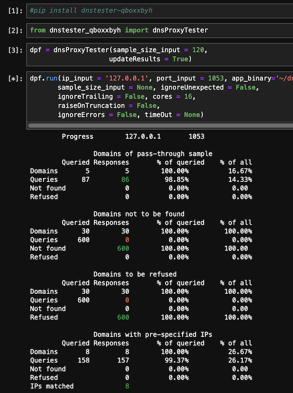

# The Python package dnstester-qboxxbyh
This is a tester for a DNS proxy filter. It can be used locally or remotely to test DNS proxy filters that rely on a specific configuration file format below:
```ini
  [server]
  listen_address = 127.0.0.1
  listen_port = 5300
                    
  [upstream]
  dns1 = 1.1.1.1
  dns2 = 8.8.8.8
  dns3 = 8.8.4.4
                    
  [blacklist]
  yandex.ru = notfind
  ya.ru = refuse
  tutu.ru = 178.248.234.61
```

# Installation

This package is available on PyPI and can be installed with ```pip install dnstester-qboxxbyh ``` or updated with ```pip install --upgrade dnstester-qboxxbyh ```

# How to use

```python
from dnstester_qboxxbyh import dnsProxyTester
tester = dnsProxyTester()
tester.run()
```

# The test results

The results are displayed and are dynamically updated in the terminal:



# Constraints

This version doesn't yet support:
* Pre-specifying both IPv4 and IPv6 for the same domain in the configuration file
* Testing the handling of non-standard multi-query DNS requests by a DNS proxy filter
